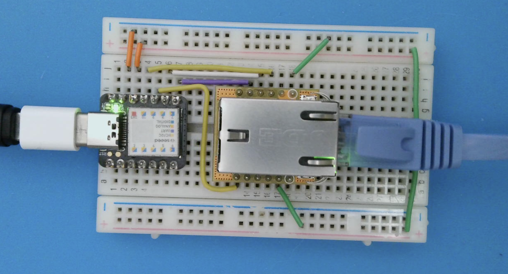
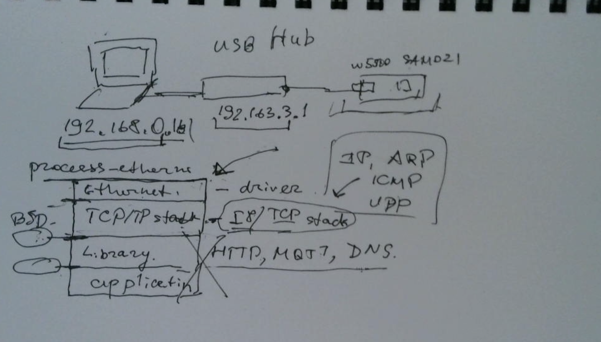

# TCP/IP stack from scratch

This is the source code for the live stream on Jan 9 2025

Files:

- stm32g031-skeleton - Ignore this. I initially though to use STM32 nucleo board and
  a make + GCC project for the stream, but decided to the Arduino and XIAO M0 instead
- sketch_jan9a - the sketch that you saw on the stream. Implements ARP and ICMP
- sketch_tcpip_stack - the sketch I've developed as a preparation for the stream.
  Implements ARP, ICMP and UDP

Code used:
- https://github.com/cesanta/mongoose - Mongoose
- https://github.com/cesanta/str - helper printing library

Hardware used: XIAO M0 and W5500 module
Here's the screenshot of my wiring:

This is the drawing of the physical setup and TCP/IP stack structure:

